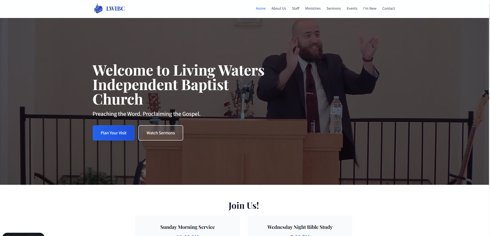

# Living Waters Independent Baptist Church Website

This is the official website for Living Waters Independent Baptist Church, Wise, VA. Built with Astro, Tailwind CSS, and Markdown content collections for a fast, modern, and content-driven church website.

**Website:** [https://lwibc.com](https://lwibc.com)

**Address:** 7561 Duncan Gap Rd., Wise, VA 24293

**Contact:** RDMinistries2021@gmail.com

**YouTube:** [LivingWatersIndependentBaptist](https://www.youtube.com/@LivingWatersIndependentBaptist)

---


## Screenshot


---

## Features

- **Pure Static Site Generation (SSG)**: Fast, SEO-friendly pages generated at build time
- **Content-Driven Architecture**: Content managed via Markdown files using Astro Content Collections
- **Mobile-First Responsive Design**: Tailwind CSS for beautiful, responsive layouts
- **SEO Optimized**: Complete meta tags, JSON-LD Schema, and sitemap.xml
- **CMS-Ready Structure**: Easily integrate with headless CMS solutions
- **Comprehensive Church Website Sections**: All essential pages for a complete church website
- **Accessibility Focus**: WCAG compliant design and markup
- **Modern UI Components**: Reusable components with hover states and micro-interactions
- **Integrated Church Icon**: Custom SVG church icon used throughout the site
- **Image Optimization**: Proper image organization and fallback handling

## Project Structure

```
lwibc/
├── public/
│   ├── uploads/          # Images directories (staff, events, sermons, etc.)
│   │   ├── staff/        # Staff profile images
│   │   ├── events/       # Event images
│   │   ├── sermons/      # Sermon thumbnail images
│   │   ├── ministries/   # Ministry logo images
│   │   └── blog/         # Blog post images
│   ├── favicon.svg
│   ├── robots.txt
│   └── site.webmanifest
├── src/
│   ├── assets/           # Astro-processed assets
│   ├── components/       # Reusable Astro components
│   │   ├── Global/       # Header, Footer, Navigation
│   │   ├── Sections/     # Page sections (Hero, Events, etc.)
│   │   └── UI/           # UI components (Button, Card, SEO)
│   ├── content/          # Astro Content Collections
│   │   ├── config.ts     # Collection schemas
│   │   ├── staff/        # Staff member profiles
│   │   ├── events/       # Church events
│   │   ├── sermons/      # Sermon content
│   │   ├── ministries/   # Ministry descriptions
│   │   ├── blog/         # Blog posts
│   │   └── siteInfo/     # Site configuration content
│   ├── layouts/          # Page layouts
│   ├── pages/            # Astro pages
│   └── utils/            # Utility functions
├── astro.config.mjs
├── tailwind.config.cjs
└── tsconfig.json
```

## Getting Started

### Prerequisites

- Node.js 18 or later
- npm or yarn

### Installation

1. Clone this repository:
   ```bash
   git clone https://github.com/ericb147/lwibc.git
   cd lwibc
   ```

2. Install dependencies:
   ```bash
   npm install
   ```

3. Start the development server:
   ```bash
   npm run dev
   ```

4. Open your browser and navigate to `http://localhost:4321`

## Content Management

### Adding/Editing Content

All content is stored in Markdown (`.md`) files in the `src/content/` directory.

#### Creating a New Staff Member

1. Create a new file in `src/content/staff/` with a `.md` extension (e.g., `john-smith.md`)
2. Add the required frontmatter fields:

```markdown
---
name: "Dr. Ricky Mullins"
title: "Senior Pastor"
image: "/uploads/staff/pastor.webp"
email: "example@gmail.com"
# phone: "+1-276-xxx-xxxx"
bio: "Bio here"
order: 1
draft: false
---
Details here
```

#### Creating a New Event

1. Create a new file in `src/content/events/` with a `.md` extension
2. Add the required frontmatter fields:

```markdown
---
title: "Vision Service 2026"
date: 2026-02-08
endDate: 2026-02-08
time: "11:00 AM"
location: "Sanctuary"
address: "7561 Duncan Gap Rd. Wise, VA 24293"
image: "/uploads/events/vision-2026.jpg"
summary: "Join us for our 2026 Vision Service for the new year and a dinner to follow in the fellowship hall."
tags: ["vision", "sunday"]
registrationRequired: false
draft: false
---

## About the Service
Join us as we look forward to what God has in store for our church in 2026. After the morning service, we will move to the fellowship hall for a meal together.

```

#### Creating a New Sermon via Script

1. Run the sermon generation script:
   ```bash
   node generate-sermons.cjs
   ```
2. The script will create the markdown file with proper frontmatter formatting
3. You will need the YouTube API key for this to work.

#### Creating a New Sermon Manually

1. Create a new file in `src/content/sermons/` with a `.md` extension
2. Add the required frontmatter fields:

```markdown
---
title: "Walking in Faith"
date: 2025-02-02
speaker: "Rev. Dr. John Smith"
series: "Faith Foundations"
scripture: "Proverbs 3:5-6"
audioUrl: "https://example.com/sermons/walking-in-faith.mp3"
videoUrl: "https://www.youtube.com/embed/example789"
image: "/uploads/sermons/walking-in-faith.webp"
summary: "Learn how to trust God completely and walk confidently in His plan."
tags: ["faith", "trust", "guidance"]
draft: false
---

## Sermon Overview

Content of your sermon goes here...
```

### Content Schema

See `src/content/config.ts` for the complete schema definitions for all content types.

## Key Pages and Features

### Main Pages
- **Homepage** (`/`): Hero section, service times, about preview, recent events/sermons
- **About Us** (`/about-us`): Mission, values, history, staff preview
- **Staff** (`/staff`): Complete staff directory with contact information
- **Ministries** (`/ministries`): All church ministries with detailed pages
- **Sermons** (`/sermons`): Sermon archive with audio/video support and filtering
- **Events** (`/events`): Upcoming and past events with registration support
- **I'm New** (`/im-new`): First-time visitor information
- **Contact** (`/contact`): Contact forms, location, staff contacts
- **Giving** (`/giving`): Online giving information and financial transparency

### Special Features
- **Responsive Design**: Mobile-first approach with proper breakpoints
- **Content Filtering**: Advanced filtering on sermons and blog posts
- **SEO Optimization**: Complete meta tags, JSON-LD schema, and sitemap
- **Accessibility**: WCAG compliant with proper ARIA labels and keyboard navigation
- **Performance**: Optimized images and fast loading times
- **Modern UI**: Hover states, transitions, and micro-interactions

## Customization

### Site Information

Update your church information in the following files:

- Site metadata in `astro.config.mjs`
- SEO defaults in `src/layouts/BaseLayout.astro`
- Contact information in `src/components/Global/Footer.astro`
- Church details throughout the content files

### Styling

This template uses Tailwind CSS for styling:

1. Customize colors and other theme settings in `tailwind.config.cjs`
2. Global styles are in `src/assets/styles/global.css`
3. The template includes a comprehensive color system with primary, secondary, and accent colors

### Logo & Branding

The template includes a built-in church SVG icon that's used throughout the site. To customize:

1. Replace the SVG icon in `src/components/Global/Header.astro` and `src/components/Global/Footer.astro`
2. Update favicon in `public/favicon.svg`
3. Modify the site manifest in `public/site.webmanifest`

### Images

Images are organized in the `/public/uploads/` directory:
- `/uploads/staff/` - Staff profile images
- `/uploads/events/` - Event images
- `/uploads/sermons/` - Sermon thumbnails
- `/uploads/ministries/` - Ministry logos

The template includes fallback handling for missing images and uses external Unsplash images for some sections.

## Headless CMS Integration

TODO:

### Decap CMS (formerly Netlify CMS)

1. Add Decap CMS config to `public/admin/config.yml`
2. The existing Content Collections structure works well with Decap CMS

## Deployment

This site is deployed and hosted on Netlify:

### Netlify

1. Push your repository to GitHub
2. Connect to Netlify
3. Set build command to `npm run build` and publish directory to `dist/`


## Browser Support

- Chrome (latest)
- Firefox (latest)
- Safari (latest)
- Edge (latest)

## License

This project is licensed under the MIT License - see the LICENSE file for details.


---

---

For questions, issues, or contributions, please contact the church office or visit our website.
